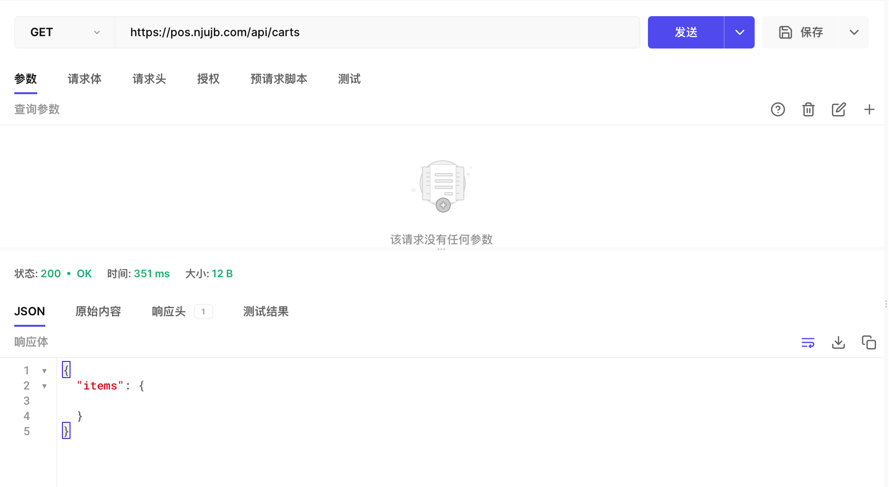
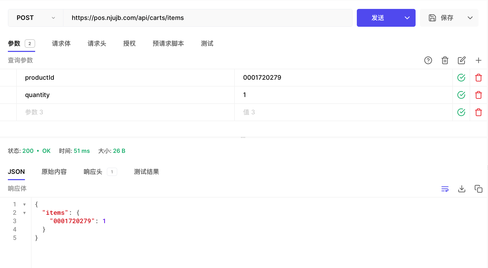
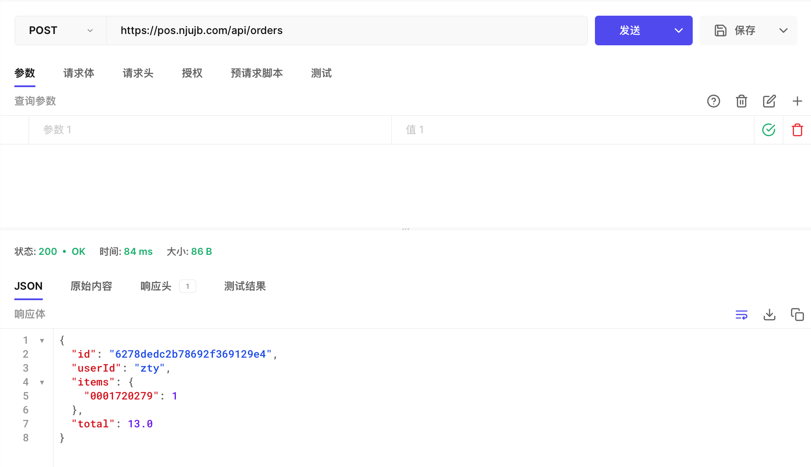
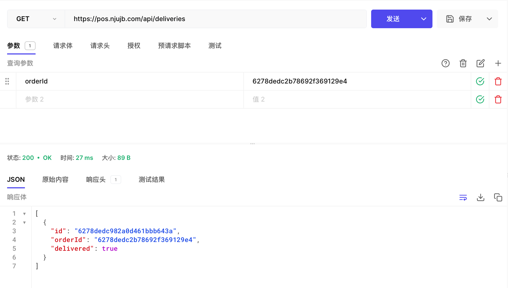
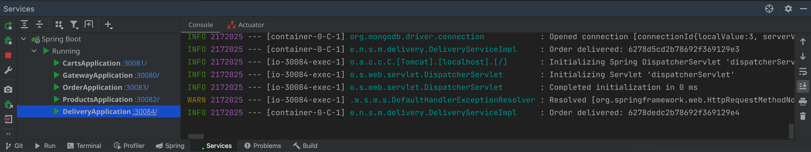

# aw07

实验环境：

- 依然是在AMD 5800X的工作站上跑，但是本地的电脑有点撑不住
- 开发环境改成使用Jetbrains Gateway
  - 运行Java变得非常流畅
    - 工位的Mac上Spring服务多了之后启动大概要等10秒
    - 工作站上1秒左右
  - 但是远程处理Maven、XML、YAML会非常非常非常卡（估计是bug）
  - 构建工具改成了Gradle之后就非常流畅
- 使用Docker运行以下服务
  - Zookeeper（服务注册，替换此前的Eureka）
  - Kafka（消息中间件）
  - MySQL（Spring Batch使用的数据库）
  - Mongo（微服务使用的数据库）
  - Redis（缓存）

实现方法：

- 从aw05的代码出发，把公共的部分抽出来成为一个模块
- 导入aw06的batch任务代码
- 添加Order Service和Delivery Service
- Order Service负责创建订单
  - 通过`RestTemplate`调用Cart Service的方法，清空购物车并创建订单
  - 创建订单后通过`StreamBridge`向消息中间件发出一个消息
- Delivery Service在收到消息后创建物流数据

`pos-client`还是aw05的老版本，没有更新；
Cart Service每次只返回同一个购物车（就是只有一个用户），
后面还有两次作业打算把Keycloak和Spring Security加进系统里，就有多个用户了。

实现结果（直接使用Hoppscotch工具测试API，用了一个域名指向工作站，通过HTTP服务器把Gateway暴露出来）：

- 获取当前购物车
  
- 向购物车添加物品
  
- 创建订单（会直接清空购物车）
  
- 查看订单对应的物流
  

订单创建后，物流服务收到消息即创建物流数据：



---

现有的API接口：

```
GET    /api/products
GET    /api/products/{productId}
GET    /api/carts
POST   /api/carts/items?productId={productId}&quantity={quantity}
DELETE /api/carts/items?productId={productId}
GET    /api/orders
POST   /api/orders
GET    /api/deliveries?orderId={orderId}
GET    /api/deliveries/{orderId}
```


> Please extend your MicroPOS system by adding a delivery service shown as the following figure.
> 
>
> When an order is placed by a user, the order serivce sends out an event into some AMQP MOM (such as RabbitMQ). The delivery service will be notified and a new delivery entry will be generated automatically. User can query the delivery status for his orders.
> Use [Spring Cloud Stream](https://spring.io/projects/spring-cloud-stream) to make the scenerio happen. Of coz you can refer to the [demo](https://github.com/sa-spring/stream-loan) for technical details.
